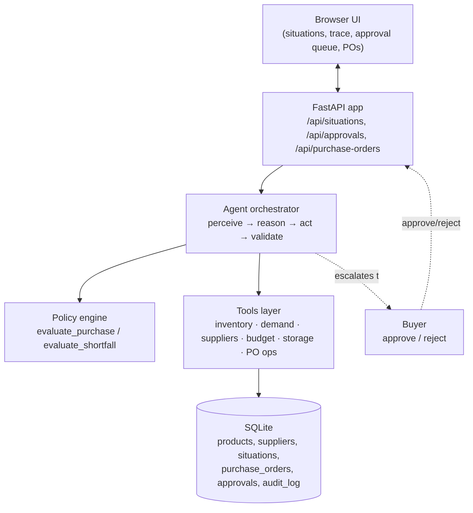

# Purchasing Agent

**Live demo:** https://ai-purchasing-agent-vsun.onrender.com
(free hosting tier — if it's been idle for 15+ minutes the first load takes
30-60 seconds to wake up, then it's instant)

A buyer support agent for a quick-commerce purchasing workflow. Given a
purchasing situation — a system recommendation, a supplier shortfall, a
demand signal that's moved, or a constraint that blocks the obvious action —
it gathers the relevant operational data itself, decides what should happen,
carries out the resulting action within its authority, and then checks that
the action actually landed the way it expected.

It does not assume the recommendation it's handed is correct. That's the
starting premise of the whole design.

## Why this shape

The brief is explicit that the goal isn't a chatbot that answers questions
about purchasing — it's a system that makes, executes, and validates
purchasing decisions. So the core of this project isn't a prompt, it's a
decision loop:

```
perceive  → gather inventory, demand, suppliers, budget, storage via tools
reason    → run the situation through a policy engine, get a decision + why
act       → create/modify a purchase order, within an autonomy threshold
validate  → re-check the constraint the decision relied on
escalate  → hand anything uncertain, large, or failed to a human
```

Four scenarios from the brief map onto this loop as different entry points
into the same two policies:

| Scenario | Entry point | Policy used |
|---|---|---|
| 1 — Recommendation review | standing PO recommendation | `evaluate_purchase` |
| 2 — Supplier can't fulfil | supplier confirms a partial quantity | `evaluate_shortfall` |
| 3 — Demand/forecast changed | no recommendation yet, actuals have moved | `evaluate_purchase`, demand re-based on actuals |
| 4 — Purchasing constraint | recommendation exists, budget/storage won't allow it | `evaluate_purchase`, constraint-bound branch |

Reusing one policy for scenarios 1/3/4 isn't a shortcut — a demand spike and
a tight budget are both just different constraints on the same underlying
question ("how much should we buy, from whom, right now"), so they belong in
the same function rather than three copies of similar logic.

## Architecture



**Tech stack**

| Layer | Choice |
|---|---|
| Language | Python 3.11 |
| Web framework | FastAPI + Uvicorn |
| Data | SQLite (stdlib `sqlite3`, no ORM) |
| Frontend | Vanilla JS / HTML / CSS, single file, no build step |
| Testing | pytest |
| Hosting | Render (free web service), deployed straight from this repo |
| Diagram / reporting | matplotlib + ReportLab (used to generate the PDF write-up, not part of the running app) |

**Backend** — Python, FastAPI, SQLite (stdlib `sqlite3`, no ORM). Seeded from
`backend/seed_data.json` on every startup, so the demo is reproducible.

**Frontend** — a single static page (vanilla JS, no build step) served by the
same FastAPI process. It shows the list of situations, lets you run the
agent on one, and renders the full reasoning trace, the decision, the
resulting purchase order, and the validation outcome. A second panel is the
buyer's approval queue for anything the agent didn't execute on its own.

**Decision engine** — deterministic and rule-based rather than a live model
call. Every decision returns the list of factors that produced it, in plain
language, and the same input always produces the same output. For a system
that commits money and inventory, that auditability and reproducibility
matters more than the flexibility of free-form reasoning — and it's directly
testable (`backend/tests/test_scenarios.py`) without needing an API key or
network access to run. The natural place a model would plug in is the
"explain this in a paragraph for a specific buyer" step, or interpreting a
free-text supplier email into the structured shortfall event this agent
consumes — the tool boundary is designed so either could be added without
touching the policy engine itself.

## What the agent can do (tools)

- `get_product` / `get_suppliers` / `get_open_purchase_orders` — read inventory, demand history, supplier terms (lead time, MOQ, price, reliability, available quantity), and open orders for a SKU.
- `read_storage_remaining` — read the shared capacity pool at a node. Deliberately modeled so a second read can return a different number than the first (see below).
- `create_purchase_order` / `update_purchase_order` — the only way the agent changes what gets bought.
- `create_approval` — the only way the agent asks a human for a decision.
- `log` — every perceive/reason/act/validate step is written to an audit trail per situation, which is what the UI's "reasoning trace" renders.

## The feedback loop

This is what the brief asks for most directly, so it's worth spelling out
with the actual example the seeded data produces (`SIT-1001`):

1. The system recommends 800 units. The agent works out that, given current
   inventory, one order already in transit, and the fastest supplier's lead
   time, only ~338 units are actually needed to hold a safe cover window —
   already well under 800.
2. Storage is tighter still: only 300 units of capacity are available at the
   decision node. Storage becomes the binding constraint, so the agent
   places a PO for 300, not 800, and executes it immediately (300 units is
   within its auto-approval cost threshold).
3. At validation time the agent re-reads the storage figure. In the seed
   data, 40 units of that capacity were reserved by another workflow between
   the decision and the confirmation check — a stand-in for the everyday
   case of two systems reading a shared number a moment apart.
4. The validation step catches that the PO it just placed (300) no longer
   fits (260 available), and — because 260 still clears the supplier's
   minimum order of 150 — trims the PO to 260 itself and logs why, rather
   than leaving an order in place that the buyer never actually saw update.
   If trimming had gone below the supplier minimum, it escalates instead of
   silently failing (see `_validate_purchase_order` in `backend/app/agent.py`).

The same validate-then-correct-or-escalate shape is what resolves Scenario 2
(a supplier shortfall is really "validation failed on an existing PO" one
step earlier in the process) and what stops Scenario 4 from ever placing a
non-compliant order in the first place.

## Autonomy boundary — when a human gets involved

The agent acts on its own when a decision is `accept`/`modify` and:
- the resulting order cost is under $5,000, **and**
- demand looks stable (no unconfirmed spike), **and**
- a compliant quantity (at or above the supplier minimum) exists.

Otherwise it stops short of acting and puts the proposal — with its full
reasoning — in front of a buyer:
- a demand spike that's real but only just emerged (not yet sustained 3 days) → `investigate`
- a demand spike that is sustained → still escalated, on the principle that a
  step-change in demand deserves a human glance even when the resulting
  order is cheap
- no quantity satisfies both the supplier minimum and budget/storage → `escalate`
- an alternate-supplier premium above 10%, or above the cost threshold, on a
  shortfall → proposed, not auto-placed

This is a judgment call, not a hard rule from the brief — the threshold and
what counts as "stable" are both constants at the top of
`backend/app/policy.py` and easy to argue with in either direction.

## Running it

```bash
cd backend
python3 -m venv .venv && source .venv/bin/activate
pip install -r requirements.txt
uvicorn app.main:app --reload
```

Open `http://localhost:8000`. The database is re-seeded from
`seed_data.json` every time the server starts, so it's always in a known
state. Click a situation, click **Run agent**, and read the trace. Anything
that lands in the approval queue can be approved or rejected from the same
page.

No environment variables are required to run the demo — see
`.env.example` for the one optional hook (a model key that would only affect
how the natural-language explanation is phrased, described above; it is not
wired into a live call in this submission).

## Tests and evaluation

```bash
cd backend
source .venv/bin/activate
python -m pytest tests/ -v          # unit + integration tests
python tests/evaluate.py            # scorecard across all seeded situations
```

`tests/test_scenarios.py` runs each seeded situation through the real agent
(not a mock) and asserts on the decision, the resulting status, and — for
`SIT-1001` — the exact post-validation quantity, so the self-correction
behaviour above is pinned down by a test, not just a demo. Two additional
cases are checked directly against the policy layer with synthetic inputs
that aren't worth seeding a whole UI situation for: a shortfall with no
alternate supplier available, and a demand blip that hasn't sustained long
enough to trust yet.

`tests/evaluate.py` is the "small set of test scenarios" the brief asks for,
run as a standalone scorecard rather than folded into pytest, so it reads
like a report:

```
situation  decision            match   status                     match   action  validated  escalated
SIT-1001   modify              True    resolved_with_adjustment    True    True    True       False
SIT-1002   accept              True    resolved                    True    True    True       False
SIT-2001   sourced_alternate   True    resolved                    True    True    True       False
SIT-3001   recommend_purchase  True    pending_approval             True    False   True       True
SIT-4001   escalate            True    escalated                   True    False   True       True
```

For each situation this checks: was the decision what's expected, did it
reach the expected status, did it take an action or correctly hold off, did
validation pass (or correctly fail closed), and did it escalate when it was
supposed to. That maps directly onto the questions in the brief's evaluation
section (was the decision correct, did it respect constraints, did it
validate the result, what happens when the initial action doesn't work).

## Data model

`backend/seed_data.json` defines 5 products, 7 suppliers, 3 open purchase
orders, and 5 situations (one per scenario, plus a second recommendation
that's already well-calibrated, as a contrast to the one that gets
corrected). Everything is small enough to read end to end in the one file —
see it for the exact numbers behind each scenario.

## Known limitations

- Single node, single buyer, no auth — this is a decision-and-execution
  demo, not a multi-tenant planning platform.
- Supplier confirmation, budget, and storage are all simulated via seed data
  rather than live integrations — `backend/app/tools.py` is the seam where
  real systems would plug in.
- The "storage drift" that drives the validation-correction demo is
  seeded per situation rather than genuinely concurrent; the mechanism it's
  standing in for (two reads of a shared counter racing) is real, the
  concurrency itself isn't.
- No persistence across restarts by design — every run starts from the same
  seed so the scenarios are reproducible on demand.
