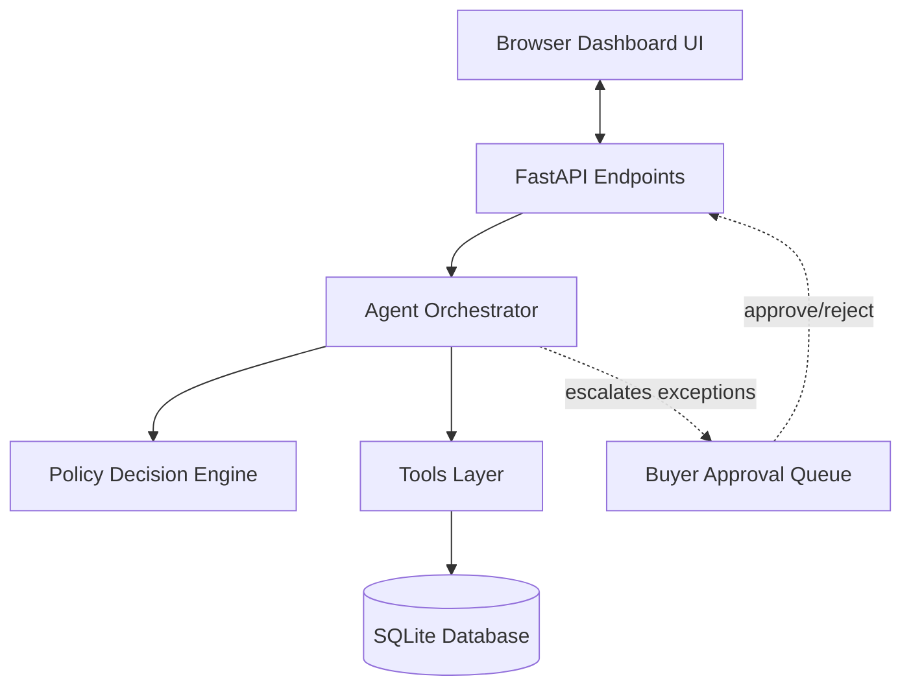

# AI Purchasing Agent

An automated purchasing decision and execution engine for quick-commerce supply chains. The agent evaluates inventory signals, determines optimal purchase quantities, executes authorized orders, and validates post-purchase constraints to prevent stockouts and over-ordering.

## 🚀 Overview

In fast-paced supply chain environments, automated purchase recommendations can easily fail if underlying conditions change between decision and fulfillment. Stock capacity can shrink, demand can spike, or suppliers may report unexpected shortfalls.

This project implements a closed-loop purchasing agent that doesn't just issue purchase orders—it actively verifies constraints before and after taking action. If storage capacity drops or a supplier quantity is updated after an order is placed, the agent detects the conflict, attempts a self-correction within safe thresholds, or routes the decision to a human buyer.

## ✨ Key Capabilities

- **Automated Order Evaluation:** Evaluates stock recommendations, demand changes, and supplier shortfalls.
- **Supplier & Constraint Analysis:** Assesses supplier lead times, minimum order quantities (MOQ), unit pricing, and node storage limits.
- **Rules-Based Decision Engine:** Uses a deterministic policy engine to ensure repeatable, auditable decisions.
- **Automated Purchase Execution:** Automatically generates and updates purchase orders for compliant, low-risk requests.
- **Post-Action Validation:** Re-checks storage and budget constraints post-execution to catch unexpected condition changes.
- **Human Approval Workflow:** Escalates high-cost, high-risk, or non-compliant decisions to a buyer approval queue.
- **Full Audit Trail:** Logs every perception step, policy factor, action, and validation check for complete operational transparency.

## 🧠 Decision Flow

Instead of relying on standard chat responses, the agent runs a continuous execution loop:

```
[ Ingest Event ] ➔ [ Fetch Operational Context ] ➔ [ Policy Decision ] ➔ [ Execute PO ] ➔ [ Re-Validate Constraints ]
                                                                                  │
                                                                           (If Escalated)
                                                                                  ▼
                                                                        [ Buyer Approval Queue ]
```

1. **Ingest Event:** Receives a purchasing signal (recommendation, shortfall, or demand shift).
2. **Fetch Context:** Reads live inventory levels, open POs, demand trends, supplier availability, and storage capacity.
3. **Policy Decision:** Runs deterministic rules to pick the optimal supplier and target quantity.
4. **Execute PO:** Creates or updates a purchase order if within safety limits.
5. **Re-Validate Constraints:** Confirms that node capacity and budgets still hold after placing the order.
6. **Buyer Escalation:** Automatically routes exceptions to a human buyer if constraints or safety thresholds are violated.

## 🏗️ System Architecture

The project consists of a single-page browser UI, a FastAPI REST service, an agent orchestrator, a policy engine, a tools data access layer, and an SQLite database.



Data flows sequentially:
**Frontend UI** ➔ **FastAPI REST API** ➔ **Agent Orchestrator** ➔ **Policy & Tools Layer** ➔ **SQLite Database** (with exception handling routed to **Human Approval**).

## 🔧 Core Components

- **Agent Orchestrator (`backend/app/agent.py`):** Coordinates data gathering, policy execution, PO creation, validation checks, and audit logging.
- **Policy Engine (`backend/app/policy.py`):** Contains pure, deterministic decision logic (`evaluate_purchase` and `evaluate_shortfall`). It returns plain-language explanation factors with zero non-deterministic LLM variance.
- **Tools Layer (`backend/app/tools.py`):** Provides data helper functions for inventory levels, supplier terms, storage capacity, and purchase order mutations.
- **SQLite Database (`backend/app/db.py`):** Stores products, suppliers, situations, purchase orders, approval queues, and step-by-step audit logs.
- **Validation Engine:** Automatically checks if post-execution storage capacity shifted. If capacity fell below order quantity, it attempts an inline quantity reduction down to the supplier MOQ or escalates to the buyer.
- **Approval System:** Manages pending buyer approvals, allowing human buyers to review full reasoning traces before approving or rejecting orders.

## 📊 Example

### Self-Correcting Order Workflow

1. **Initial Signal:** System recommends buying **800 units** of a product.
2. **Analysis:** The agent reviews current inventory and transit orders, calculating a true requirement of **338 units**.
3. **Execution:** Storage capacity at the node is **300 units**. Because 300 units is under the **$5,000** auto-approval limit, the agent places a PO for **300 units**.
4. **Post-Action Shift:** During post-execution validation, the agent detects that concurrent storage reservations reduced available capacity to **260 units**.
5. **Self-Correction:** The agent verifies that 260 units clears the supplier's MOQ (150 units), automatically updates the PO to **260 units**, and records the self-correction in the audit trail.

## 🛡️ Safety & Human-in-the-Loop

The agent is bounded by explicit autonomy guards to maintain financial and operational safety.

### Automatic Execution Conditions
The agent auto-places or updates purchase orders only when:
- The decision is `accept` or `modify`.
- The total order cost is under **$5,000**.
- Demand history is stable (no unconfirmed demand spikes).
- Order quantity satisfies supplier MOQ, node storage capacity, and budget.

### Human Escalation Triggers
The agent halts execution and routes to the buyer approval queue when:
- Order value exceeds **$5,000**.
- An unconfirmed demand spike requires human verification.
- Storage capacity is lower than the supplier's minimum order quantity.
- A supplier shortfall requires an alternate supplier with a cost premium exceeding thresholds.

## 💻 Tech Stack

| Layer | Technology | Description |
|---|---|---|
| **Backend** | Python 3.11+, FastAPI, Uvicorn | REST API framework & server |
| **Data Layer** | SQLite (`sqlite3` stdlib) | Relational database (no ORM) |
| **Frontend** | Vanilla JS, HTML5, CSS3 | Single-page UI with zero build steps |
| **Testing** | pytest | Integration test suite & scorecard runner |
| **Deployment** | Render Web Service | Free-tier cloud hosting configuration |

## 📁 Project Structure

```
.
├── backend/
│   ├── app/
│   │   ├── agent.py          # Execution loop & validation logic
│   │   ├── db.py             # SQLite schema & seed loader
│   │   ├── main.py           # FastAPI application endpoints
│   │   ├── policy.py         # Deterministic policy rules
│   │   ├── tools.py          # Data retrieval & PO helper functions
│   │   └── __init__.py
│   ├── tests/
│   │   ├── evaluate.py       # Standalone decision scorecard runner
│   │   ├── test_scenarios.py # Pytest integration test suite
│   │   └── __init__.py
│   ├── requirements.txt      # Python package dependencies
│   └── seed_data.json        # Test seed data (products, suppliers, POs)
├── frontend/
│   └── index.html            # Dashboard UI & reasoning trace viewer
├── .env.example              # Environment configuration template
├── .gitignore                # Git exclusion rules
├── Purchasing_Agent_Approach.pdf # Architectural overview PDF
├── README.md                 # Project documentation
└── render.yaml               # Cloud deployment configuration
```

## ⚡ Getting Started

### Prerequisites
- Python 3.11+
- Git

### Installation & Run

1. **Clone the repository:**
   ```bash
   git clone https://github.com/atulmint/Purchasing-agent.git
   cd Purchasing-agent/backend
   ```

2. **Create and activate a virtual environment:**
   - **Linux / macOS:**
     ```bash
     python3 -m venv .venv
     source .venv/bin/activate
     ```
   - **Windows (PowerShell):**
     ```powershell
     python -m venv .venv
     .\.venv\Scripts\Activate.ps1
     ```

3. **Install dependencies:**
   ```bash
   pip install -r requirements.txt
   ```

4. **Launch the server:**
   ```bash
   uvicorn app.main:app --reload
   ```

5. **Open in browser:**
   Navigate to `http://localhost:8000`. The database automatically seeds from `seed_data.json` on startup.

## 🧪 Testing

The repository includes both unit/integration tests and an evaluation matrix runner.

### Run Integration Tests
```bash
cd backend
python -m pytest tests/ -v
```

### Run Evaluation Scorecard
Generates a summary report verifying expected decisions, status outcomes, and escalation behavior across all seeded purchasing situations:
```bash
cd backend
python tests/evaluate.py
```

## 🌐 Demo

A live demonstration is hosted on Render:

🔗 **[Live Project Demo](https://ai-purchasing-agent-vsun.onrender.com)**

*(Note: Free-tier instance may require 30–60 seconds to wake up if inactive).*

## ⚠️ Current Limitations

- **Single Node Scope:** Focuses on single-warehouse decisions rather than multi-node network redistribution.
- **Simulated Data Environment:** Inventory levels, storage capacity, and supplier stock are populated from seed data rather than live enterprise ERP/WMS systems.
- **Stateless Database Model:** SQLite database re-initializes on startup to guarantee clean, reproducible runs.

## 🔮 Possible Next Steps

- **Live System Integrations:** Add connectors for real-time ERP, WMS, and supplier EDI/API feeds.
- **Persistent Storage:** Replace SQLite seed-reset pattern with persistent PostgreSQL database support.
- **Auth & Access Controls:** Implement multi-role access (Buyer, Purchasing Manager, Admin).
- **LLM-Powered Natural Language Processing:** Integrate an optional LLM interface to parse unstructured supplier email communications and summarize decision traces.
- **Distributed Concurrency:** Implement distributed locking mechanisms for shared inventory and storage capacity pools.

## 👨‍💻 Project Notes

This project was built to demonstrate a pragmatic engineering approach to supply chain automation: using deterministic policy logic for predictable financial decisions, enforcing post-execution constraint validation, and maintaining a strict human-in-the-loop escalation model for exception cases.
